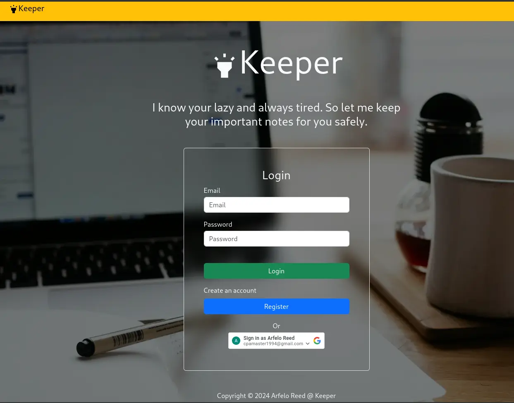
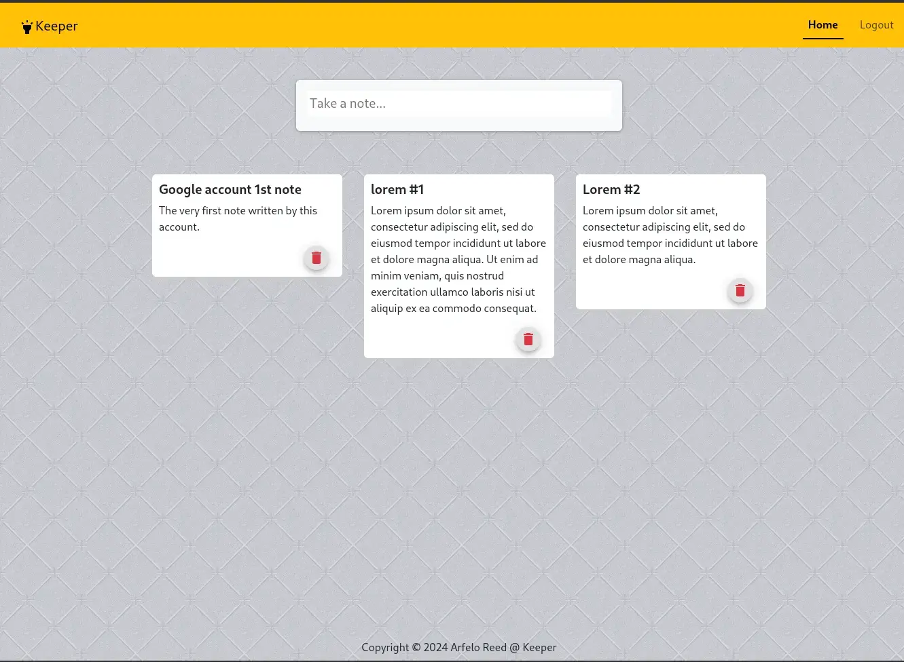

# Keeper

***Site live at @[keeper](https://keeper-ol3w.onrender.com) on render.***

A keeper clone personal project. Use to store notes.

### Features

1. Traditional user authentication
    - Can register and login via email and password. Password is hashed when stored in the database.

2. Google authentication
    - Allows user to register and login via google auth.

3. Store and delete notes for you.

 
*Notes:*

This is the whole of the app. The repo consists of both the client and server side. The client side was made with ReactJs without a TS configuration. The server side was made with NodeJs configured in Express.

The live web app is upload on render. So check it out. [keeper on render](https://keeper-ol3w.onrender.com)